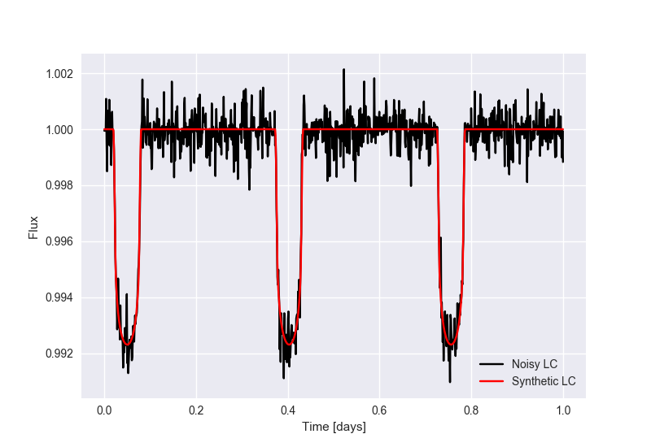
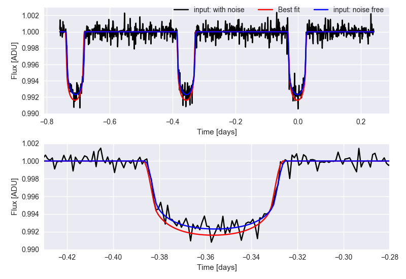

Fitting a Planetary transit
================================

In this example we show the usage of an initialization function, to optimize the evaluation of the fitness function.

The goal is to build a simulated Light Curve (flux level of a star over time), with a dip in it (caused by a planet blocking part of its light, on our line of sight). To do so, we must first build a model capable of simulating such an event:

.. code-block:: python 

    import batman
    import numpy as np

	def calculate_period(a, RS, MS):
	    G = 6.67408e-11
	    M_sun = 132712440018 * 1000 ** 3 / 6.67408e-11  # Kg
	    R_sun = 696342e3  # meters
	    return np.sqrt(4 * np.pi ** 2 * (a * RS * R_sun) ** 3 / (G * MS * M_sun)) / (
	        24 * 3600
	    )

	def init_transit_model(transit_params, time, star_params ):
	    """
	    Creates the batman model using the desired values.
	    """
	    params = batman.TransitParams()  # object to store transit parameters
	    params.t0 = transit_params["t0"]  # time of inferior conjunction
	    params.per = calculate_period(transit_params['a'], RS=star_params['star_radius'], MS=star_params['star_radius'])  # orbital period
	    params.rp = transit_params['r_p']  # planet radius (in units of stellar radii)
	    params.a = transit_params['a']  # semi-major axis (in units of stellar radii)
	    params.inc = transit_params['inc']  # orbital inclination (in degrees)
	    params.ecc = 0.  # eccentricity
	    params.w = 90.  # longitude of periastron (in degrees)
	    params.limb_dark = star_params['limb_type'] # limb darkening model
	    params.u = star_params['limb_coefs'] # limb darkening coefficients [u1, u2, u3, u4]

	    m = batman.TransitModel(params, time)  # initializes model
	    return m, params

	def create_transit_model(model, params):
	    """
	    Creates a light curve array with the model and chosen parameters
	    """
	    return model.light_curve(params)

	def edit_transit_params(params, p, star_radius, star_mass):
	    """
	    Changes the batman TransitParams that are being fitted for the new parameters 
	    """
	    params.rp = p['r_p']  # planet radius (in units of stellar radii)
	    params.a = p['a']  # semi-major axis (in units of stellar radii)
	    params.inc = p['inc']  # orbital inclination (in degrees)
	    params.t0 = p['t0']   # time of inferior conjunction -> center of lightcurve
	    params.per = calculate_period(p['a'], RS=star_radius, MS=star_mass)
	    return params

	def pre_process_LC(time, flux):
		"""
			Center the Light Curve on the minimum point
		"""
	    time = time - time[np.argmin(flux)]
	    return time, flux

Using this model, we now build a Light Curve with know parameters and add noise to it:

.. code-block:: python 

    star_params = { 
        'star_radius': 1.0,
        'star_mass': 1.0,
        'limb_type': 'quadratic',
        'limb_coefs': [0.36, 0.3] 
    }

    transit_params = {'r_p': 0.08,
                        'a': 2.1,
                        'inc': 87,
                        't0': 0.05
                    }

    times = np.linspace(0, 0.1, 200)

    model_tra, params_tra = init_transit_model(transit_params, times, star_params)

    curve = create_transit_model(model_tra, params_tra)

    yerr = 0.001 * np.random.rand(200)

    y_noisy = curve + yerr * np.random.randn(200)

The data that we will use as input for our model will be: 

Now we proceed to define the initialization function and the fitness function:

.. code-block:: python

    import numpy as np 
    from rues import  Genetic
	
	def fitness(data_x, data_y, ind_parameters, initial_config, **kwargs):

	    star_params = kwargs['star_params']
	    params = edit_transit_params(initial_config['batman_params'], ind_parameters, star_params['star_radius'], star_params['star_mass'])
	    curve = create_transit_model(initial_config['batman_model'], params)
	    residuals = data_y - curve

	    return 1/np.sum(np.abs(residuals))

	def initial_setup(X, Y, **kwargs):
	    transit_params = {'r_p': 0.01,
	                        'a': 1.1,
	                        'inc': 10,
	                        't0': 0
	                    }   # just to create a default light curve

	    model, params =  init_transit_model(transit_params, X, kwargs['star_params'])
	    initial_config = {'batman_params': params, 'batman_model': model}
	    return initial_config

,the parameter space limits:

.. code-block:: python 

    param_limits = {'r_p':[1e-3, 1],
                     'a':[1e-3, 6],
                     'inc': [0, 90],
                     't0': [-time[0], time[-1]]

                     }

, configure the population:

.. code-block:: python

    configuration_dict = {
        'keep_alive': True,
        'offspring_ratio': 0.90,
        'mutate_prob': 0.25,
        'processes': 6,
        'crossover_type': 'blend',
        'alpha_value': 0.5,
        'mutation_type': 'uniform',
        'reinsertion_type': 'age',
        'selection_type': 'tournament',
        'tourn_size': 32,
        'worker_params': {'fit_func': fitness, 'initial_setup': initial_setup, 'star_params':star_params},
        
    }

Now we initialize the model and wait until the desired generation is met:

.. code-block:: python 

    time, flux = pre_process_LC(times, y_noisy)
    pop = Genetic(700, param_limits, configuration_dict)
    pop.fit(time, flux, 300)

Afterwards, plot the results:

.. code-block:: python
	

	fitted_params = pop.get_optimal_params()
    model_tra, params_tra = init_transit_model(transit_params, time, star_params)

    curve = create_transit_model(model_tra, params_tra)

    fig, axes  = plt.subplots(2,1)

    for index in [0,1]:

        axes[index].plot(time, y_noisy, color = 'black', label = 'input: with noise')         
        axes[index].plot(time, curve, color ='red', label = 'Best fit')
        axes[index].plot(time, real_y, color = 'blue', label = 'input: noise free')

        if index == 1:
            axes[index].set_xlim([-0.43, -0.28])
            axes[index].set_ylim([0.99, 1.002])
    

        axes[index].set_xlabel("Time [days]")
        axes[index].set_ylabel('Flux')

    plt.show()

Even though the final result is not a perfect match against the "noise free" Light Curve, we see that the fitted model closely resembles the noisy data that we use for the fit. 

