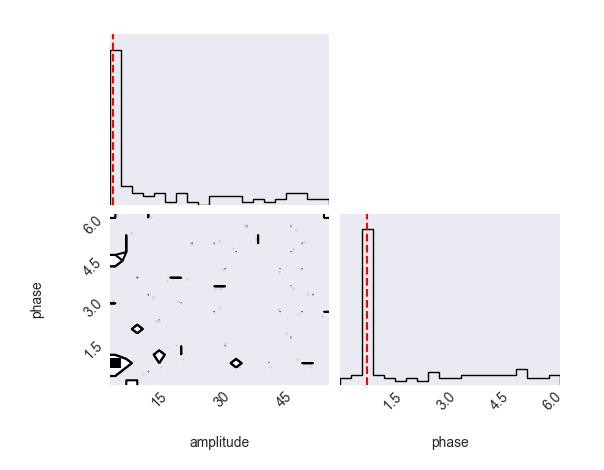

.. _SinFit:

Sinusoidal fit
================================

In this example we showcase **rues** by fitting a sinusoid to (simulated and noise) oscillatory data.

We start by creating a sinusoid and adding random noise to it:

.. code-block:: python
 
    import numpy as np 

    x = np.linspace(0, 2*np.pi, 200)
    amplitude = 4
    phase = np.pi/4

    y_noise_free = amplitude * np.sin(x + phase)
    yerr = 0.5 * np.random.rand(200)
    y_noisy = y_noise_free + yerr * np.random.randn(200)
    

To apply **rues** we start by defining the model and the fitness function to perform the optimization. As our GA approach attempts to maximize the fitness function we have to use the inverse of the distance between the model and the (noisy) data: 

.. code-block:: python

	def fitness(data_x, data_y, ind_parameters, initial_config, **kwargs):
	    """
	        data_x and data_y are the arrays with the data that is being fitted.

	        ind_parameters is a dictionary whose keys are the parameters names

	        kwargs is the 'worker_params' dictionary 
	    """

	    residuals = data_y - model(ind_parameters['amplitude'], ind_parameters['phase'], data_x)
	    return 1/np.std(residuals) 

	def model(amplitude, phase, X):
	    """
	        Simple sinusoidal model
	    """
	    return amplitude * np.sin(X + phase)

After building the description of the data we must configure the different processes of the GA method. In this (simple) example we do not need to initialize a model beforehand, so the "initial_setup" is None.

.. code-block:: python

    configuration_dict = {
        'keep_alive': True,
        'offspring_ratio': 0.5,
        'mutate_prob': 0.01,
        'processes': 4,
        'crossover_type': 'blend',
        'alpha_value': 0.5,
        'mutation_type': 'uniform',
        'reinsertion_type': 'age',
        'selection_type': 'tournament',
        'tourn_size': 4,
        'worker_params': {'fit_func': fitness, 'initial_setup': None},
        
    }

Lastly, we only have to decide on the population size and the limits of the parameter space that is going to be explored:

.. code-block:: python

    from rues import  Genetic

    population = Genetic(100, {'amplitude':[0,6], 'phase':[0, np.pi*2]}, configuration_dict)
    population.fit(X = x, Y = y_noisy, max_iterations =  200)

    optimal_params = population.get_optimal_params()  # returns the individual with the highest fitness level

    print("OPTIMAL PARAMETERS: ", optimal_params)
    # {'amplitude': 4.06042435186686, 'phase': 0.7854295918011562}
    print("True parameters: ", 4, np.pi/4)
    
    y_model = model(optimal_params['amplitude'], optimal_params['phase'], x)

We can plot the results of the fit: 

.. code-block:: python
	

    import matplotlib.pyplot as plt 
    plt.style.use("seaborn-dark")

    fig, ax = plt.subplots(2,1, figsize=(8,4), sharex = True)
    ax[0].set_title("Final Fit")
    ax[0].plot(x, y_noise_free, color = 'black', label = 'input w/ noise')
    ax[0].plot(x, y_noisy, color = 'blue', label = 'input with noise')
    ax[0].plot(x, y_model, color = 'red', label = 'model')

    ax[1].set_title("Residuals")
    ax[1].plot(x, y_noisy-y_model, label = 'residuals')
    
    plt.tight_layout()
    ax[0].legend(bbox_to_anchor = (0.4,0.78), ncol = 3)

    ax[0].set_ylabel("Data")
    ax[1].set_ylabel("Residual level")
    plt.show()

.. figure:: ../Figures/simple_output.png

And also look at the distribution of all elements in the final population (in the diagonals) and search for correlation between the parameters (in the other plots):

.. code-block:: python 
	
	population.create_corner()

The red line shows the parameters of the individual with the highest fitness level. When using a small population, such as in this case with only 200 individuals, the non-diagonal plots will not behave properly and it is not possible to see the contour of the distributions.