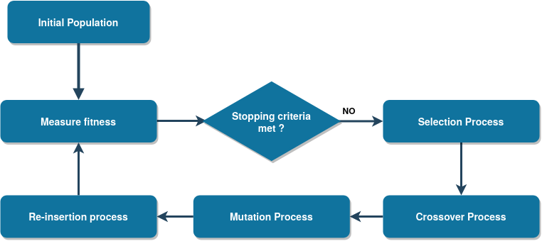
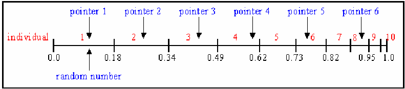
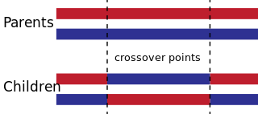
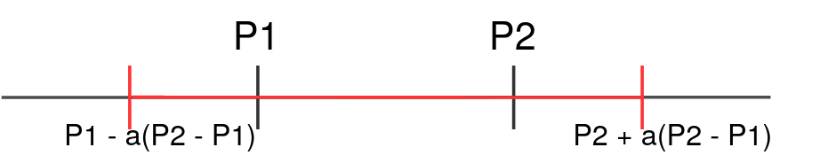

.. _GAintro:

What are Genetic Algorithms
================================
  

General Overview
-------------------------

Genetic algorithms (GAs) are general optimization algorithms that use principles found in natural genetic populations to construct and evolve solutions to problems. The goal behind them is to maintain a population of individuals, each with its own chromosomes representing a solution, that is then evolved throughout time due to competition and controlled variation. Each individual has a metric, or “fitness” associated with it, measuring the quality of the individual in relation to all others.

If we are working on a continuous domain, we use real-valued genetic algorithms, where the chromosomes are vectors of floating point numbers, contrasting the binary GAs approaches, where the chromosomes are binary representations of the parameters.

The evolution process can be summarized in 5 different stages:

	* Initial population creation;
	* Calculation of the fitness function;
	* Selection process;
	* Crossover process;
	* Mutation of individuals.

We start by creating the initial population and calculating the initial fitness of each individual in it. Then, we let the population evolve by selecting the individuals that will be bale to produce offspring (selection process). Afterwards, the offspring are created from the selected individuals (crossover process) and mutating them if some conditions are met (mutation process). After recalculating the fitness of the evolved population we choose which individuals are going to be switched with the new ones (re-insertion process), and go back to the selection stage, until the stopping criteria has been met. This criteria can either be reaching a certain number of iterations or reaching a certain level of fitness. A schematic of this process is given in the following Figure: 

The Population
-------------------------

The genetic algorithm process starts by creating an initial population, that will be the starting point for the exploration of the parameter space. In order to build the initial population we can follow one of two approaches: either randomly choose parameters within the parameter space to build each individual or sample from a set of know solutions :cite:`sloss_2019_2019`  . In **rues** the former was implementing, allowing for a very diverse initial population, spread within the parameter bounds.

There are two types of GAs populations: steady state and generational. The difference between them is the number of elements from the previous generation that are kept for the following one. In the generational model most, or all, of the population is replaced. Within this framework a part of the population may survive, with the criteria depending on the re-insertion model that is used. In the steady state model only one, or two, individuals are switched in each generation :cite:`dyer_aerospace_2012`.

There is a trade off between the two models, that one should take into account when deciding the one to use. Whilst the generational model will yield a larger amount of diversity, due to the higher number of children, the steady-state model will allow, in most cases, to reach a good solution as the one generated offspring will typically be used to replace the worst performer of a given generation. Take note that if there are no good solutions within the initial population, the steady state model will have to rely on the possibility of the new member of each generation mutating, which will slow down evolution towards the best region of the parameter space. Thus, it is not optimal to use this model when treating complex models.

Fitness Function 
-------------------------

As we have discussed, genetic algorithms are inspired in the evolutionary behaviour of individuals in nature, i.e. only the fittest individuals survive and get to pass forward their traits.

Thus, to be able to do so, we must find a way of measuring how good each individual is at solving our problem or, in other words, if the proposed solution is good or not. This is done through the fitness function, a function that measures the suitability of the individual. Typically, and what was implemented in **rues**, the best individuals for a given problem have higher fitness scores, which leads to the highest-fitness individual being the best possible solution for the problem.

Selection Process
-------------------------
Now that we can characterize the fitness of each individual of the population, we must choose the ones that will survive and reproduce, to build the next generation. In **rues** we implemented a few different selection algorithms:

* Roulette wheel:  In this approach the fittest individuals have an higher likelihood of being chosen, as the probability of being chosen is proportional to the individual's fitness :cite:`coley_introduction_1997`. We start by drawing a random number between zero and the sum of the fitness of all individuals, f\ :sub:`sum`\. Then, we add together, one by one, the fitness of each individual in our population. The individual whose cumulative sum surpasses this random number, is the one chosen for selection. The process is then repeated for each parent that we want to choose.

* Stochastic Universal sampling: This method is an improvement of the Roulette wheel selection, since it allows to select at once all of the desired individuals. We first decide on the number of elements that we want to select, N, and we draw a random number, R, in the range [0, 1/N]. Afterwards, we create N points, separated by R, and starting from R. Then, we choose the individuals whose fitness span over each point, :cite:`pencheva_tania_modelling_2010`, as depicted in the following Figure:  

  Schematic of the Stochastic Universal sampling algorithm. Image taken from pencheva_tania_modelling_2010.

* Tournament selection: As the name might suggest, in this selection method we randomly choose a subset of the population and, from it, we choose the indiidual with the highest score to be a parent :cite:`miller_genetic_nodate`, similarly to a tournament. Choosing the size of the tournament can greatly impact the diversity of our population. If we use an high tournament size, it's very likely that we will only choose the fittest individuals of the entire population, thus compromising the diversity of our population and difficultating the exploration of the parameter space. However, if we use a smaller tournament size there is a reasonable chance of individuals with lower fitness to be allowed to reproduce, thus increasing the diversity of the parent pool.

 
Crossover process
-------------------------
    The crossover process will allow us to combine the parent's information, and propagate it to the generated offspring. There are many different methods of doing so, although some of them are more focused to binary problems, whilst others are able to be used in real valued problems. In **rues** we have only implemented two of them, however there are many more that we can choose :cite:`walchand_college_of_engineering_crossover_2015,herrera_tackling_1998` .

    * K point crossover: This crossover algorithm chooses chunks of information from each parent :cite:`haupt_practical_2004` and attribute it to the children, i.e. the offspring is built with alternating blocks of parameters, from each parent, as depicted here:

  Schematic of the K-point crossover, for two parents, yielding two offspring. Taken from `Wikipedia <https://en.wikipedia.org/wiki/File:TwoPointCrossover.svg>`_. 

    * Blend crossover: In this method, we build an interval around the solutions of the parents and randomly sample within that interval, for each parameter :cite:`kacprzyk_multiobjective_2009`. The interval in use is contained in the range [param\ :sub:`min`\ - :math:`\Delta`  parents; param\ :sub:`max`\ + :math:`\Delta` parents], where param\ :sub:`min`\ is the value of the smallest parameter, param\ :sub:`max`\ the highest parameter and :math:`\Delta` parents is the difference between the two parents, as depicted here: 

  Schematic of the blend crossover, for two parents P1 and P2. The new parameter is a random draw from the interval  in red.

Re-insertion
-------------------------

In the cases where a part of the current generation survives for the next one, we have to find a way of deciding which individuals to keep and which ones to discard. Currently, two different approaches were implemented in **rues**: fitness based selection and age based selection.

The former, chooses the best individuals to carry on to the next generation, whilst the later removes the oldest individuals of the population. In a first approach, fitness selection seems to be the best approach but, since only the fittest elements survive, it may lead to early convergence scenarios due to a reduction of the diversity. In such cases we could have an entire population near a local maximum, instead of searching for the global one.

Mutation of Individuals
-------------------------

In an attempt to avoid early convergence of the population to a local maximum, the individuals are randomly mutated, to diversify the species. However, not all individuals are mutated, since that would transform our problem into a random walk in the parameter space. Instead, a user-chosen probability, typically small, is provided, and then used to see if a child is mutated at birth or not. There is a great number of possible mutation operators that could be used :cite:`herrera_tackling_1998`, but we have only implemented one of them.

* Uniform mutator: In this method the mutation of a gene is a random sample within the possible values that the given parameter can take :cite:`haupt_practical_2004`. This mutation is applied to all genes of the individual and we have added a 50\% chance of a given gene not being able to mutate.

.. rubric:: References

.. bibliography:: ../biblio.bib
  :cited:
  :style: unsrt