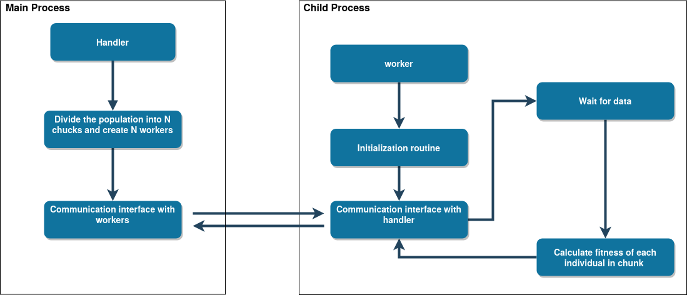

How to control rues
================================

In order to use the library the user must define the fitness function (which will drive the optimization routine), 
and configure the overall behaviour of the population (selection, crossover, mutation and re-insertion)

.. _Thefit:

The Fitness Function
--------------------------------------------

The fitness function will drive the evolution of the population (higher fitness correspond to better solutions). 

This function **must always have** the following format:

.. code-block:: python

    def fitness(data_x, data_y, ind_parameters, initial_config, **kwargs):

The first two arguments, data_x and data_y will be the data that we are trying to fit (i.e. the input data). Afterwards we have access to the *ind_parameters*, the parameters of the individual as a dictionary. The keys of this dictionary are the names of the genes of the individual, as explained in :ref:`ThePop` . The *initial_config* argument is a dictionary, described in more detail in :ref:`Theinit` and the *kwargs* are described in the :ref:`ThePop`.  Even if there is not an initialization routine to be performed, this parameter needs to exist, as it will be passed to this function (albeit with no real use).

.. _Theinit:

Initialization of the model
---------------------------------

If our model needs to perform an initialization routine, i.e. run something (only one time) before evaluating the fitness function for the entire population, we can initialize it beforehand. As the fitness function is evaluated (for different individuals) in parallel (multiple cores at once) we must explicitly define an initialization routine, that will work as in the following Figure:

This initialization function must conform to the following format:

.. code-block:: python

	def initial_setup(X, Y, **kwargs):
		# place code here
	    initial_config = {'foo': 1, 'bar': 1}
	    return initial_config

X and Y are the data that is going to be fitted and the kwargs are the ones that will eventually reach the worker, as described in :ref:`ThePop` 

The output of this function **must be** a dictionary, that will then enter the *fitness* function, described in :ref:`Thefit` 

.. _ThePop:

The Population
--------------------

The population is also configured by a dictionary, with most of the keys being "fixed" and some must be included under some conditions. A typical configuration
dictionary looks like this:

.. code-block:: python

    configuration_dict = {
        'keep_alive': True,
        'offspring_ratio': 0.90,
        'mutate_prob': 0.25,
        'processes': 6,
        'crossover_type': 'blend',
        'mutation_type': 'uniform',
        'reinsertion_type': 'age',
        'selection_type': 'tournament',
        'tourn_size': 32,
        'worker_params': {'fit_func': fitness, 'initial_setup': initial_setup},
        
    }

Going over them one by one:

	* keep_alive : maintain the multiple processes alive until the last generation is computed. Otherwise new processes will be launched at each generation
	* processes: number of processes that will be launched to evaluate the fitness function
	* offspring_ration: percentage of the population that will be created as offspring
	* mutate_prob: mutation probability of each individual when it is created
	* crossover_type: Possibilities:

		- blend : blend crossover; If chosen, the configuration_dict must also have the key 'alpha_value'
		- K_point : K-point crossover; If chosen, the configuration_dict must also have the key 'K_value'

	* mutation_type: type of mutation. Currently only support the uniform mutation
	* reinsertion_type: keep (1 - offspring ration) % of the previous population following the routineS:

		- age  : keep newest individuals
		- fit  : keep fittest individuals

	* selection_type: choose selection algorithm:

		- tournament : Tournament selection. If chosen, the 'tourn_size' (tournament size) must also be passed
		- roulette : roulette wheel selection
		- universal_sampling : stochastic universal sampling

	* worker_params: Information that will reach each worker:

		- 'fit_func' : fitness function, described in :ref:`Thefit`
		- 'initial_setup' : Initialization routine, described in :ref:`Theinit`. must either be a function or None
		-  One can add extra parameters to this dictionary, to both reach the initialization routine and the worker 

Lastly, we need to initalize the population:

.. code-block:: python
	
	limits = {'foo': [0, 100], 'bar':[0,100]}

    population = Genetic(pop_size, limits, configuration_dict)

Where pop_size is the number of elements in the population, *limits* is a dictionary that attributes the names to the parameters and defines the limits of the 
parameter space and *configuration_dict* is the dictionary with the worker configurations.

Optimizing the model and results
----------------------------------------

Lastly, we run the optimization routine, by passing the data and the maximum number of generations.

.. code-block:: python

    population.fit(X = data_x, Y = data_y, max_iterations =  200)

To retrieve the results we can create a corner plot:

.. code-block:: python
	
	population.create_corner()

Retrieve the optimal parameters (highest fitness):

.. code-block:: python
	
	population.get_optimal_params()

Retrieve the entire population, sorted by fitness level (from lowest to highest):

.. code-block:: python
	
	population.get_sorted_population()

This will return a list with each individual inside it. To get data from the individuals:

.. code-block:: python
	
	individual = population.get_sorted_population()[-1]  # element with the highest fitness

	# fitness level: 
	fitness = individual.score

	# dictionary equal to the one returned by population.get_optimal_params()
	parameters = individual.parameters 

More information and examples are given in the :ref:`SinFit` Section and beyond.